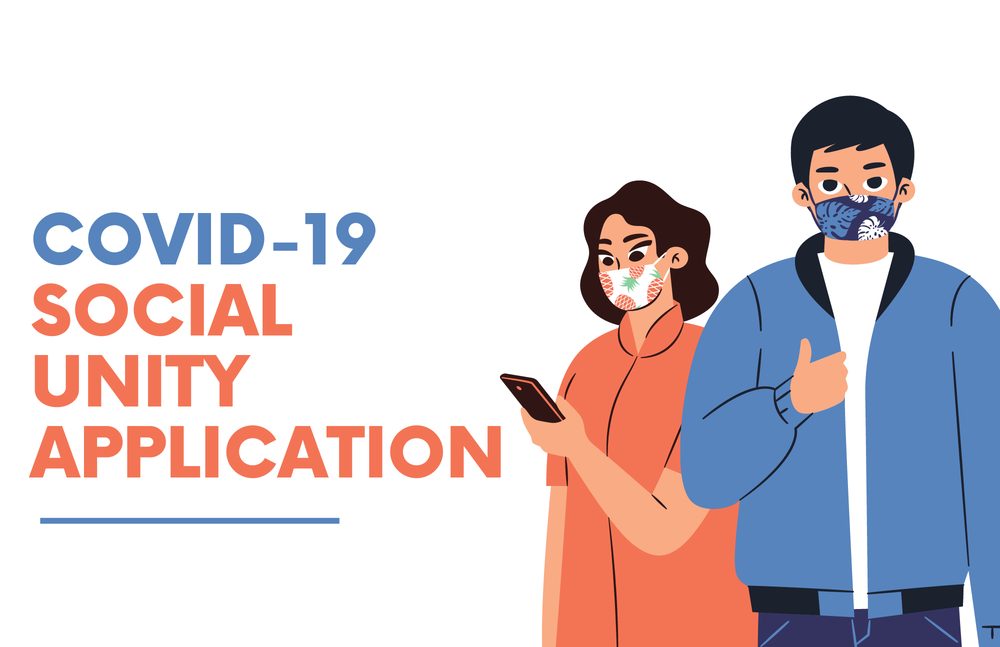
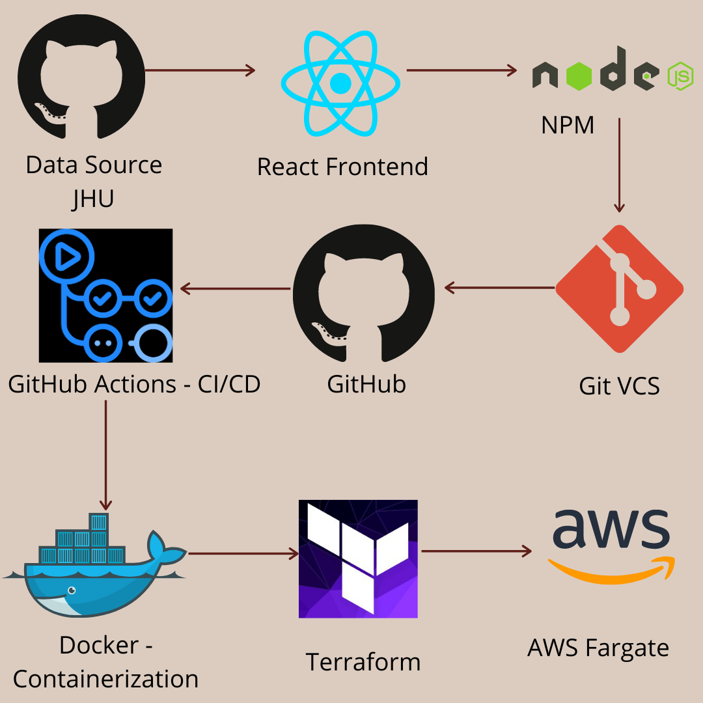
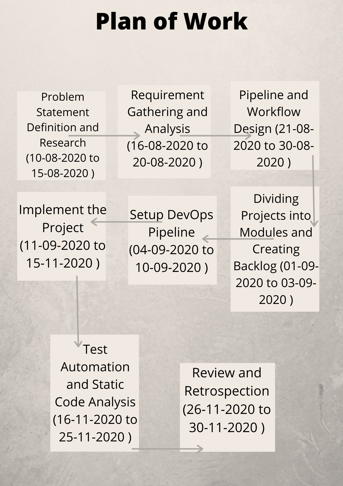

<h1 align="center">Covid-19 Social Unity Application</h1>

## Development Workflow



## Run this project on local workstation

```
$ git clone [Repository URL]
$ cd [Repository name]
$ npm install
$ npm run build
$ npm start
```

* Go to http://localhost:3000

## Run this project via Docker container

```
$ docker run -it -p 3000:3000 [username]/[repository]:[branch/tag]
$ docker run -it -p 3000:3000 nishkarshraj/covid19
```

* Go to http://localhost:3000

## How to Contribute

This project is open-sourced and contributions are welcomed in all forms.

Please adhere to the contribution [guidelines](docs/CONTRIBUTING.md).

## Plan of work



## Hosted project Link

https://socialunity.herokuapp.com/statistics/dashboard

## Code of Conduct

[Code of Conduct](docs/CODE_OF_CONDUCT.md)

## References

https://github.com/CSSEGISandData/COVID-19

## License

[MIT](LICENSE) License
